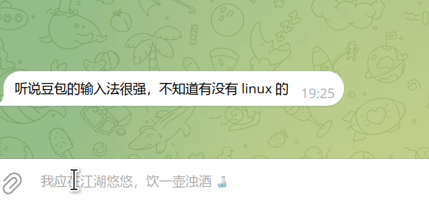

# Coe (聲)

[English](./README.md) | [简体中文](./docs/README.zh-CN.md) | [日本語](./docs/README.ja.md)

Coe is a voice input tool for Linux desktops.

It is a Linux-focused tribute to [`missuo/koe`](https://github.com/missuo/koe). The goal has not changed: press a hotkey, speak, let an LLM clean up the transcript, and put the text back into the active app.

## Demo



## The Name

`coe` is close to `koe` on purpose. This project nods to Koe, but it targets Linux and Wayland. The old kanji `聲` means voice. That is the job.

## Why Coe?

The first author uses Linux, but people do not love building desktop software for Linux. Coe tries to make this practical:

- Background process, plain YAML config, minimal UI surface
- Reuse other people's capabilities first: fcitx, portal clipboard, and so on
- Make voice input work as well as possible inside those limits

## How It Works

The runtime flow is:

1. Keep `coe serve` running in the background, usually through a user-level `systemd` service.
2. Trigger dictation.
   In `runtime.mode: fcitx`, the Fcitx5 module calls Coe over D-Bus and commits the final text back through the current input context.
   In `runtime.mode: desktop`, GNOME calls `coe trigger toggle` through a custom keyboard shortcut.
3. Record microphone input with `pw-record`.
4. Reject near-silent or obviously corrupt captures instead of sending them out.
5. Send the audio to ASR. Coe supports OpenAI, SenseVoice, or local `whisper.cpp`.
6. Optionally send the transcript to an OpenAI-compatible text model for cleanup.
7. Deliver the final text on screen: either commit it through Fcitx, or paste it back into the focused app.

## Installation

### Quick Install

The simplest path is the release installer:

```bash
curl -fsSL -o /tmp/install.sh https://raw.githubusercontent.com/quailyquaily/coe/refs/heads/master/scripts/install.sh
bash /tmp/install.sh
```

It downloads the matching GitHub Release tarball for your Linux architecture. If `fcitx5` is installed, it prefers `fcitx` mode automatically. Otherwise it falls back to `desktop` mode.

After installation, edit `~/.config/coe/config.yaml` and configure at least the `asr` and `llm` sections. See [`docs/configuration.md`](./docs/configuration.md) for details.

If you are on GNOME Shell, log out and log back in once so GNOME Shell picks up the Coe extension.

Then open any app with an input focus, press the default shortcut `<Shift><Super>d`, speak, then press it again. If all is well, your speech should come back as text in that app.

### Arch Linux

```bash
yay -S coe-git
```

### Install Dependencies

**`fcitx5` mode**

- `fcitx5`
- `pw-record`

**`desktop` mode**

- `pw-record`
- `wl-copy`

On Ubuntu, install the command-line dependencies with:

```bash
sudo apt update
sudo apt install -y pipewire-bin wl-clipboard
sudo apt install -y ydotool
```

## Configuration

Coe uses plain files for configuration.

Config file:

- `~/.config/coe/config.yaml`
- repo example: [`config.example.yaml`](./config.example.yaml)

Create the default config with:

```bash
go run ./cmd/coe config init
```

That writes `~/.config/coe/config.yaml`.

For the full field-by-field reference, see [`docs/configuration.md`](./docs/configuration.md).

Quick summary:

- default hotkey: `<Shift><Super>d`
- default hotkey behavior: `hotkey.trigger_mode: toggle`, meaning press once to start dictation and press again to stop. The optional `hold` mode starts on key press and stops on key release, and only works in `runtime.mode: fcitx`
- supported ASR providers: `openai`, `whispercpp`, `sensevoice`, `qwen3-asr-vllm`
- LLM cleanup supports upstream models behind any OpenAI-compatible API

## Desktop Integration

Two integration paths exist today:

- `runtime.mode: fcitx`: Fcitx handles the hotkey, text commit, and dictation status.
- `runtime.mode: desktop`: `GlobalShortcuts` or the GNOME custom shortcut fallback handles the hotkey, and portal clipboard / paste handles text output.

**GNOME-specific parts**

The install script also installs a GNOME Shell extension that exposes the focused window `wm_class` over D-Bus. Coe uses that to distinguish normal apps from terminal-like targets.

## Current Status

Working:

- [x] compatibility with other desktop environments through the Fcitx5 module
- [x] GNOME Wayland fallback trigger through an auto-managed GNOME custom shortcut that runs `coe trigger toggle`
- [x] microphone capture through `pw-record`
- [x] LLM transcript cleanup for repeated words and filler words
- [x] SenseVoice FastAPI as an ASR provider
- [x] GNOME desktop notifications
- [x] filtering silent or damaged recordings
- [x] built-in basic scenes

Missing:

- [ ] a stronger answer for the upstream microphone / PipeWire saturation issue
- [ ] custom instructions
- [ ] custom scenes and scene switching

## Other

Portal access persistence:

- If `persist_portal_access` is `true`, Coe stores the portal restore token locally
- After the first successful authorization, later runs try to reuse that token instead of prompting every time

## Commands

- `coe doctor`
- `coe config init`
- `coe restart`
- `coe serve`
- `coe trigger toggle`
- `coe trigger start`
- `coe trigger stop`
- `coe trigger status`
- `coe version`

## Docs

- [`docs/development.md`](./docs/development.md)
- [`docs/configuration.md`](./docs/configuration.md)
- [`docs/README.md`](./docs/README.md)
- [`docs/install.md`](./docs/install.md)
- [`docs/architecture.md`](./docs/architecture.md)
- [`docs/fallbacks.md`](./docs/fallbacks.md)
- [`docs/gnome-globalshortcuts-matrix.md`](./docs/gnome-globalshortcuts-matrix.md)

## Star History

[](https://www.star-history.com/?repos=quailyquaily%2Fcoe&type=date&legend=top-left)
